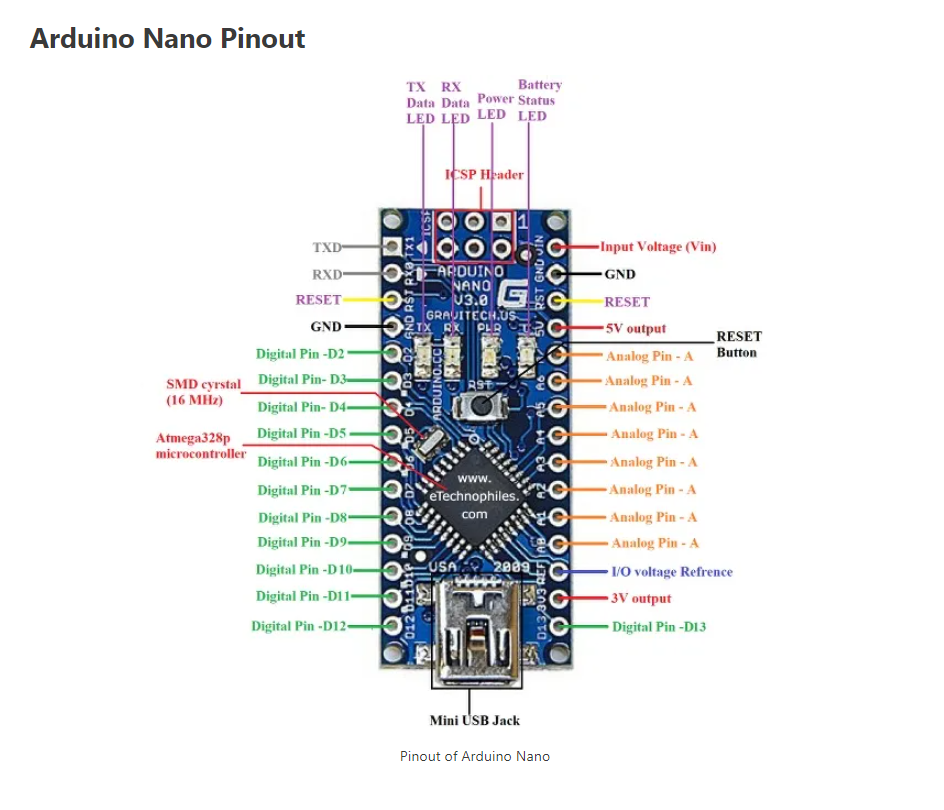

# Google DevFest 2022 - High School track
## Arduino Project Development

[1. Kit Assembly Instructions](https://www.youtube.com/embed/videoseries?list=PLiBItcliDLPdlyGqTrn8cgXpW_A-7ckfb)
This YouTube playlist steps through every stage of the assembly process.

[2. Download Adruino IDE](https://www.arduino.cc/en/software)

[3. Arduino Language Reference](https://www.arduino.cc/reference/en/)

[4. Arduino Nano Overview](https://docs.arduino.cc/hardware/nano)
## pinout

Arduino is an open-source electronics platform based on easy-to-use hardware and software. It's intended for anyone making interactive projects.

They produce a wide variety of boards for a wide variety of needs. We will be using the Arduino nano. This is an inexpensive board that is perfect for small projects.

